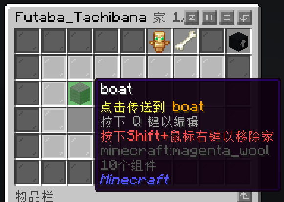

# 基础插件

## 家
服务器允许玩家设置**至多5个**家。设置方法非常简单，只需要输入指令`/sethome <家的名字>`，即可创建新的家。

如图，使用指令`/sethome boat`则创建了一个名字为boat的家，其中的boat可以更改为你觉得容易记住的名字。

如果你忘记了自己设置过多少家，或者家的名字，只需要输入`/homes`，打开家的GUI菜单。

在这里，我设置了一个名字叫做boat的家，**左键**可以直接传送，**Q**可以编辑（设置槽位等），**Shift+鼠标右键**可以移除家。

移除家还有更加方便的方法，即使用指令`/removehome <家的名字>`。

## 传送申请
你的好友离你太远？赶路太费时间？即刻申请传送，下一秒你便可出现在你的好友面前！

输入`/tpa <玩家名字>`即可申请传送至他身边，输入`/tpahere <玩家名字>`即可申请让他传送至你身边。申请发出后，TA会收到一个类似这样的传送申请。

点击同意后，玩家便会传送到你们身边，或者你传送到TA身边。

当然，你也可以不同意！

## 随机传送
服务器提供了随机传送的功能，输入`/rt`即可随机传送至一定范围内的一个随机的位置，这尤其适用于开荒、跑图等场景。

随机传送需要一定的时间，并且有30s的冷却时间。

随机传送不一定会将你传送至安全的位置！请做好万全的准备。

## 经济
输入`/balance`查看自己的余额。

输入`/baltop`查看富豪榜。

有关如何赚钱的文档，请点击[这里](/vanilla/trade)查阅。