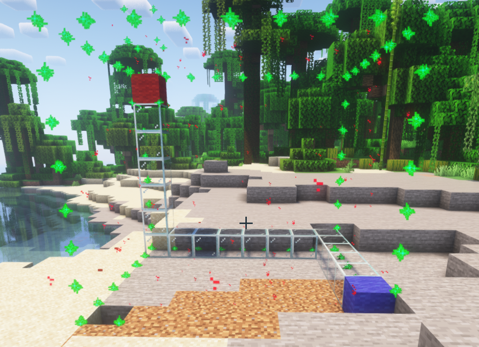
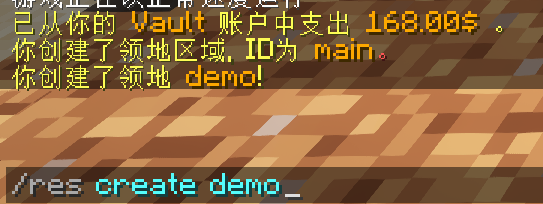
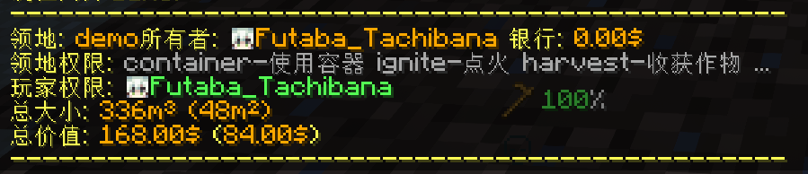
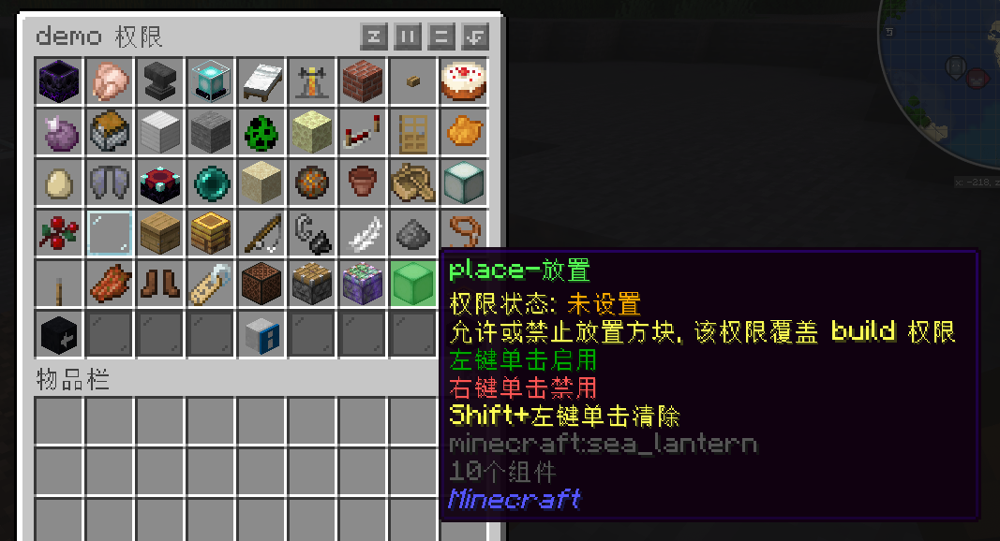
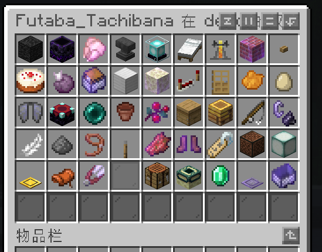
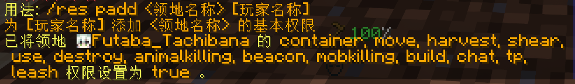
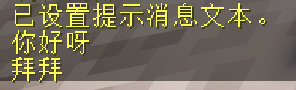

# 领地
每个玩家应当给自己的家设置领地。

## 创建领地
创建领地，需要先准备一个木锄头，左键框选第一个角点（红色羊毛），右键框选第二个角点（蓝色羊毛）。框选后你将会看到一个可视化了的选择区域。

输入`/res create <领地名字>`创建领地。在这里我创建了一个名字叫做demo的领地。

创建领地后，你的账户会自动扣除相应的金额。每个方块的圈地费用是0.5。

## 查看领地
输入`/res info [领地名字]`即可查看对应领地的信息（所有者、权限、价值等），如果你想查看你当前所在的领地的信息，则只需要输入`/res info`。

## 领地传送
输入`/res tp <领地名字>`即可传送至对应的领地。

## 领地权限
使用`/res set [领地名字]`可以打开一个菜单，在这个菜单内可以设置更加详细的领地权限。注意领地名字是可选的，但是如果你不在某个领地内，领地名字是必填的。

如图，我右键单击海晶灯，即可禁止其它玩家在我的领地放置方块。

输入`/res pset [玩家名字] [领地名字]`即可设置指定玩家在指定领地内的权限。玩家名字省去则默认是自己，领地名字省去则默认是当前所在的领地。

使用`/res padd [领地名称] <玩家名称>`可为某个玩家设置某个领地的基本权限（放置、破坏、箱子等）。注意插件内描述的尖括号和方括号的含义与本文档正好相反。

## 自定义领地消息
要想设置进出领地的提示消息，使用命令`/res message [领地名称] <leave/enter> [文本]`。如果没有文本内容，或者文本设置的内容是remove，那么将会清除进入或离开领地的消息提示。

## 删除领地
要想删除领地，需要先输入`/res remove [领地名称]`，然后再输入`/res confirm确认`。

