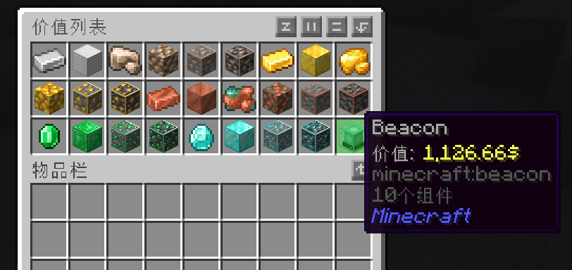
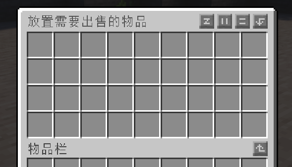
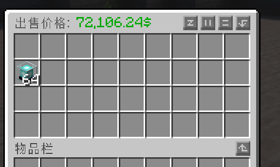
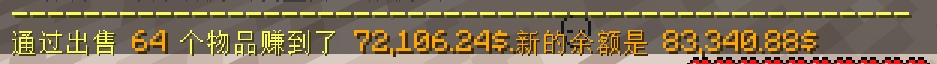

# 交易

## 向服务器出售物品
创建领地需要金钱，那么金钱从何而来？你可以向服务器出售物品来获得对应的金钱。

输入`/worthlist`查看当前市场，你可以出售这些物品。可出售的物品以及收购价会有变动，一切以游戏内容为准。如图所示，当前，信标的价值是1126.66元。

最简单的出售物品的方法是，输入`/sell gui`。

然后我把物品拖入菜单内。

我想出售一组信标，那么理应获得*72106.24*元，按`E`或者`Esc`关闭这个菜单，你将会获得对应的金钱。

